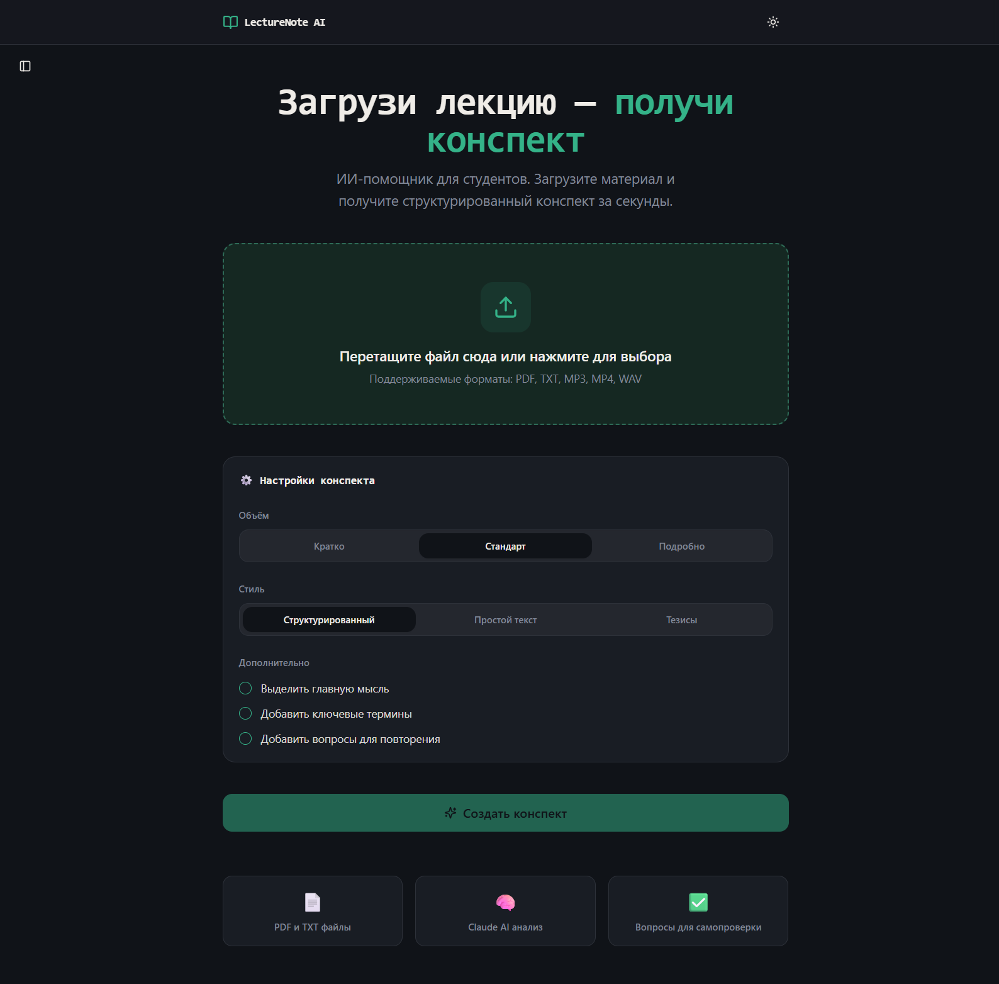

# 📘 Lecture Companion

> **Lecture Companion** is an AI-powered EdTech platform engineered to streamline the university study workflow. It transforms dense lecture materials into structured summaries, interactive Q&A sessions, and automated **Exam Preparation Quizzes** using modern LLM architectures.

[🔗 Live Demo: lecture-companion-five.vercel.app](https://lecture-companion-five.vercel.app/)

---

## 🎯 Overview
College students often struggle with information overload, inefficient note-taking, and passive reading during exam preparation. **Lecture Companion** solves this by applying **Active Recall** and **Spaced Repetition** principles. Once a lecture is processed, students can immediately test their comprehension through an interactive **Exam Mode**, turning passive reading into active learning.

---

## 🚀 Key Features

* **⚡ Smart Lecture Summarization:** Automatically condenses multi-page notes, transcribes concepts, and extracts key takeaways into actionable bullet points.
* **🎯 Interactive Exam Mode (Quiz Generator):** 
  * Generates customized test questions directly from the processed lecture content.
  * Evaluates student answers in real-time with detailed explanations for correct and incorrect options.
  * Tracks exam readiness and knowledge retention.
* **💬 AI Contextual Q&A:** An intelligent study assistant that grounds its answers strictly in the provided lecture notes to avoid hallucinations.
* **📊 Adaptive Dashboard:** A clean, minimal interface for organizing study materials across different courses and subjects.

---

## 🛠 Tech Stack

* **Frontend:** React (Vite), TypeScript, Tailwind CSS
* **State Management:** Zustand (lightweight, predictable state handling for quiz sessions)
* **AI Engine:** Claude API (Anthropic LLM)
* **Deployment & Hosting:** Vercel

---

## 🧠 Architectural Highlights & Engineering Challenges

### 1. Interactive Exam State Engine
* **Challenge:** Managing complex UI states during the quiz (active question, selected answers, timer, score calculation, and final results breakdown) without unnecessary re-renders.
* **Solution:** Designed a centralized Zustand store with atomic state updates, decoupling the quiz evaluation logic from the UI view components.

### 2. Prompt Engineering for Quiz Extraction
* **Challenge:** Ensuring the LLM returns structured JSON data for questions, answer options, and correct explanations without breaking formatting.
* **Solution:** Structured the prompt with strict JSON Schema constraints using Anthropic's Claude API, paired with client-side fallback parsing to guarantee reliable rendering.

### 3. Latency Optimization (Streaming API)
* **Challenge:** Long generation times when processing full lectures into comprehensive summaries.
* **Solution:** Integrated Response Streaming (`Server-Sent Events`), allowing users to read generated summaries incrementally as tokens arrive.

---

## 🔮 Future Roadmap

- [ ] **Multi-format Support:** DOCX, and more formats.
- [ ] **Spaced Repetition Flashcards:** Export generated questions into Anki or internal flashcard decks.
- [ ] **Multi-language Localisation:** Tailored support for Central Asian languages (Kyrgyz, Kazakh, Russian) for regional universities.

---

*Developed by Nurtilek — [nurtilek.dev](https://nurtilek.dev)*